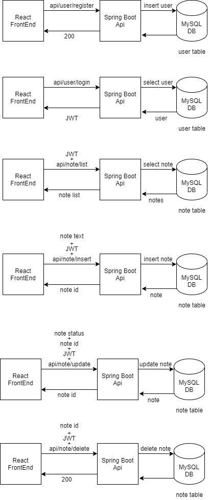

# TO-DO List App 
TO-DO List App With Spring Boot, React and MySQL For Code Challenge

Project has backend on Spring Boot and frontend on ReactJs. MySQL DB selected. Project deployed to Heroku And ClearDB.

You can check swagger-ui for endpoint explanations.

Features:
- User Registration
- Login
- Note Add / Check / Delete 

Link: https://spring-react-mysql-todo-app.herokuapp.com

Tech Stack:
- Java 8
- Maven
- Spring Boot
- Hibernate
- JWT
- ReactJs
- MySQL
- Lombok
- Swagger
- JUnit

Project Structure

